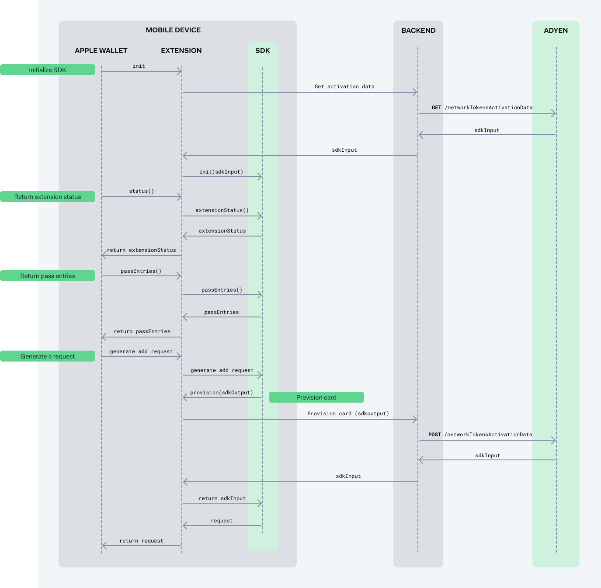

# Adyen Apple Pay Provisioning

In-App Provisioning enables cardholders to add their payment cards to Apple Wallet directly from your app. This feature provides a quick and secure way for users to add their payment information without having to manually enter card details.

-----

## Get the Adyen SDK

The Adyen Apple Pay Provisioning SDK is available on [GitHub](https://github.com/Adyen/adyen-apple-pay-provisioning-ios/). Please follow the `README.md` file for detailed installation instructions.

### System requirements

Before you start, make sure your environment meets the following requirements:

  * Targets **iOS 13.4** or later.
  * **Xcode 14** or later.
  * **Swift 5.7** or later.

-----

## In-app provisioning

With Apple Pay in-app provisioning, your cardholder can add their card directly from your app. During the in-app flow, the cardholder taps **Add to Apple Wallet** and the provisioning process starts and finishes within your app providing a seamless flow.

The following diagram walks you through the in-app provisioning flow. Green labels correspond to the steps described further on the page:


1. [Get activation data](#get-activation-data)
2. [Check if a card can be added](#check-if-a-card-can-be-added)
3. [Initiate card provisioning](#initiate-card-provisioning)
4. [Provision the card](#provision-the-card)
5. [Finalize card provisioning](#finalize-card-provisioning)


### Get activation data

Before you can start card provisioning, you must get activation data for the payment instrument.

1. From your backend, make a `GET` request to the `/paymentInstruments/{id}/networkTokenActivationData` endpoint, specifying the ID of the payment instrument. Your API credential needs the following role:

      * **Bank Issuing PaymentInstrument Network Token Activation Data role**

    ```bash
    curl https://balanceplatform-api-test.adyen.com/bcl/v2/paymentInstruments/{id}/networkTokenActivationData \
    -H 'x-api-key: YOUR_BALANCE_PLATFORM_API_KEY' \
    -H 'content-type: application/json' \
    ```

    The response contains the `sdkInput` object that you need to initialize the SDK in the next step.

2. Pass the `sdkInput` to your app.

### Check if a card can be added

After receiving the `sdkInput`, initialize the `ProvisioningService`. Use it to check if the cardholder can add the card to Apple Wallet on the current device or a paired Apple Watch. If the card cannot be added, it means it's already in the Wallet. You must determine watch availability yourself, for example by using our provided `WatchAvailability` helper class.

```swift
import AdyenApplePayProvisioning

// Create a single instance of WatchAvailability
let watchAvailability = WatchAvailability()

let provisioningService = try ProvisioningService(sdkInput: sdkInput)
let isWatchActivated = await watchAvailability.activate()
let state = provisioningService.canAddCardDetails(isWatchActivated: isWatchActivated)

if state.canAddCard {
    // Show "Add to Apple Wallet" button
}
```

Use the `canAddCard` boolean to conditionally show or hide the **Add to Apple Wallet** button in your UI.

### Initiate card provisioning

When the cardholder taps **Add to Apple Wallet**, initiate provisioning by calling the `start()` method, passing a `delegate` and a `presentingViewController`.

```swift
try provisioningService.start(
    delegate: self,
    presentingViewController: viewController
)
```

### Provision the card

Implement `ProvisioningServiceDelegate` to receive the `provision(sdkOutput:)` callback from the SDK. In this callback:

1.  From your backend, make a `POST` request to the `paymentInstruments/{id}/networkTokenActivationData` endpoint. Include the `sdkOutput` from the delegate method in your request body to provision the payment instrument. The response from your backend will contain a new `sdkInput` object.
2.  Return the new `sdkInput` from the `provision` method.


```swift
func provision(sdkOutput: Data, paymentInstrumentId: String) async -> Data? {
    struct ProvisioningRequestBody: Encodable {
        let sdkOutput: Data
    }

    // The server sends sdkInput as a Base64 encoded string; JSONDecoder decodes it into a Data object.
    struct ProvisioningResponse: Decodable {
        let sdkInput: Data
    }

    do {
        let encoder = JSONEncoder()
        encoder.dataEncodingStrategy = .base64
        let body = try encoder.encode(ProvisioningRequestBody(sdkOutput: sdkOutput))
        
        // TODO: POST the body to your server and receive data back.
        
        let decoder = JSONDecoder()
        decoder.dataDecodingStrategy = .base64
        let response = try decoder.decode(ProvisioningResponse.self, from: data)
        return response.sdkInput
    } catch {
        return nil
    }
}
```

### Finalize card provisioning

When provisioning is complete, the SDK calls the `didFinishProvisioning` delegate method. Use this callback to update your UI, for example by changing the button text to **Added to Apple Wallet**.

```swift
func didFinishProvisioning(with pass: PKPaymentPass?, error: Error?) {
    // Update your UI
}
```

-----


## Provisioning from the Wallet App

You can also allow cardholders to provision cards directly from the Apple Wallet app. To enable this, you must implement a wallet extension. Your app's name and icon will then appear in the Wallet's list of apps that can provide cards.

The following diagram walks you through the wallet extension provisioning flow. The green labels correspond to the steps described below:



1. [Return extension status](#return-extension-status)
2. [Return pass entries](#return-pass-entries)
3. [Provision the card](#provision-the-card-from-the-extension)
4. [Generate a request to add a payment pass](#generate-a-request-to-add-a-payment-pass)


### Before you begin

Before implementing the Wallet provisioning flow:

1. [Add the Apple Wallet extension](#add-the-apple-wallet-extension).
2. [Add the Apple Wallet UI extension](#add-the-apple-wallet-ui-extension).

#### Add the Apple Wallet extension

1. Add a new target to your Xcode project with any Extension template. Then, change the values under the `NSExtension` dictionary in the `Info.plist` as follows:

2.  In the target's `Info.plist`, find the `NSExtension` dictionary and set the following values:

    |Key|Type|Value|
    |---|---|---|
    | `NSExtensionPointIdentifier` | String | **com.apple.PassKit.issuer-provisioning** |
    | `NSExtensionPrincipalClass` | String | **$(PRODUCT\_MODULE\_NAME).WalletExtensionHandler** |

3.  Create an `WalletExtensionHandler` class that is a subclass of `PKIssuerProvisioningExtensionHandler`.


```swift
import PassKit

class WalletExtensionHandler: PKIssuerProvisioningExtensionHandler {
}
```

#### Add the Apple Wallet UI extension

The Apple Wallet can use an extension from your app to authenticate the cardholder before provisioning.

1.  Add another **Target** to your Xcode project for the UI extension. In its `Info.plist`, set the following values in the `NSExtension` dictionary:

    |Key|Type|Value|
    |---|---|---|
    | `NSExtensionPointIdentifier` | String | **com.apple.PassKit.issuer-provisioning.authorization** |
    | `NSExtensionPrincipalClass` | String | **$(PRODUCT\_MODULE\_NAME).WalletUIExtensionHandler** |

2.  Create an `WalletUIExtensionHandler` class that is a subclass of `UIViewController` and conforms to the `PKIssuerProvisioningExtensionAuthorizationProviding` protocol. Use the `completionHandler` to communicate the result of the authentication.

### Return extension status

The Wallet app calls your extension with strict time limits. The first method, `status()`, must complete within **100 ms**. Because a network call is not feasible, you must use cached activation data (e.g., stored in the keychain) for this step.

1.  In your main app, save the `sdkInput` after fetching it. Retrieve this stored value in your extension.
2.  Initialize the `ExtensionProvisioningService`.

```swift
import AdyenApplePayExtensionProvisioning

// For one payment instrument:
let provisioningService = try ExtensionProvisioningService(sdkInput: sdkInput)

// For multiple payment instruments:
let provisioningService = try ExtensionProvisioningService(sdkInputs: [sdkInput1, sdkInput2, ..])
```

3.  Implement the `status()` method by calling `extensionStatus()` on the SDK. Use the `requiresAuthentication` parameter if you provide a UI extension.

```swift
func status() async -> PKIssuerProvisioningExtensionStatus {
    // Initialize the service from a cached sdkInput
    // ...

    return provisioningService.extensionStatus(requiresAuthentication: true)

    // If the service could not be initialized from cache:
    return ExtensionProvisioningService.entriesUnavailableExtensionStatus
}
```

### Return pass entries

To return available passes, you must implement `passEntries()` and `remotePassEntries()`. These methods have a **20-second** time limit, which allows for a network call to refresh the `sdkInput`.

1.  From your backend, fetch a fresh `sdkInput` for each payment instrument you want to display.
2.  Initialize the `ExtensionProvisioningService` with the new data.
3.  The Wallet app shows a preview of the card. To provide the card image, implement the `ExtensionProvisioningServiceDelegate` and its `cardArt(paymentInstrumentId:)` method. Return a `CGImage` that accurately represents the payment card.

```swift
func cardArt(paymentInstrumentId: String) -> CGImage {
    // Return card art for the given ID
}
```

4.  Implement `passEntries()` and `remotePassEntries()` by calling the corresponding methods on the SDK and passing your delegate.

```swift
func passEntries() async -> [PKIssuerProvisioningExtensionPassEntry] {
    return await provisioningService.passEntries(withDelegate: self)
}

func remotePassEntries() async -> [PKIssuerProvisioningExtensionPassEntry] {
    return await provisioningService.remotePassEntries(withDelegate: self)
}
```

### Provision the card from the extension

To provision the card when the extension requests it:

1.  Implement `ExtensionProvisioningServiceDelegate` to receive the `provision(paymentInstrumentId:sdkOutput:)` callback.
2.  In the callback, make a `POST` request to your backend with the `sdkOutput` to provision the card.
3.  Return the new `sdkInput` received from your backend.

```swift
func provision(paymentInstrumentId: String, sdkOutput: Data) async -> Data? {
    // Make a network call to your backend with the sdkOutput
    // and return the new sdkInput from the response.
    // This logic is identical to the in-app provisioning flow.
}
```

### Generate a request to add a payment pass

The `WalletExtensionHandler` is re-instantiated for each method call, so you must re-initialize the SDK each time.

1.  Re-initialize the `ExtensionProvisioningService` by fetching fresh `sdkInput` data, as described in the earlier steps.
2.  Implement the `generateAddPaymentPassRequestForPassEntryWithIdentifier(...)` method by calling the corresponding method on the SDK. Pass your delegate to handle the provisioning call.

```swift
func generateAddPaymentPassRequestForPassEntryWithIdentifier(
    _ identifier: String,
    configuration: PKAddPaymentPassRequestConfiguration,
    certificateChain certificates: [Data],
    nonce: Data,
    nonceSignature: Data
) async -> PKAddPaymentPassRequest? {
    // Re-initialize provisioningService here...
    
    return try? await provisioningService.generateAddPaymentPassRequestForPassEntryWithIdentifier(
        identifier,
        configuration: configuration,
        certificateChain: certificates,
        nonce: nonce,
        nonceSignature: nonceSignature,
        delegate: self
    )
}
```
