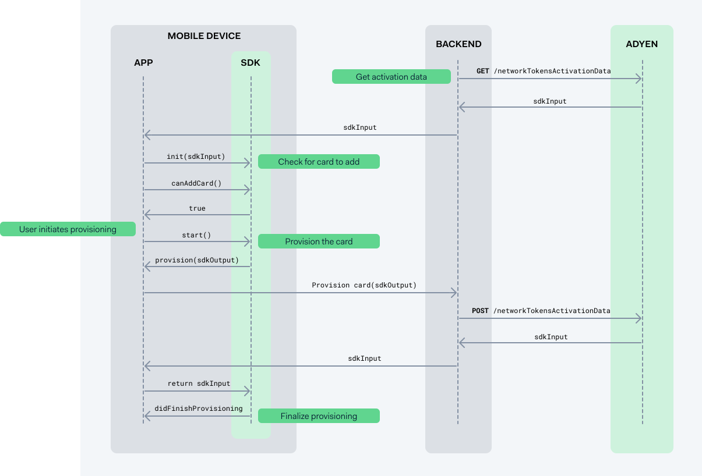
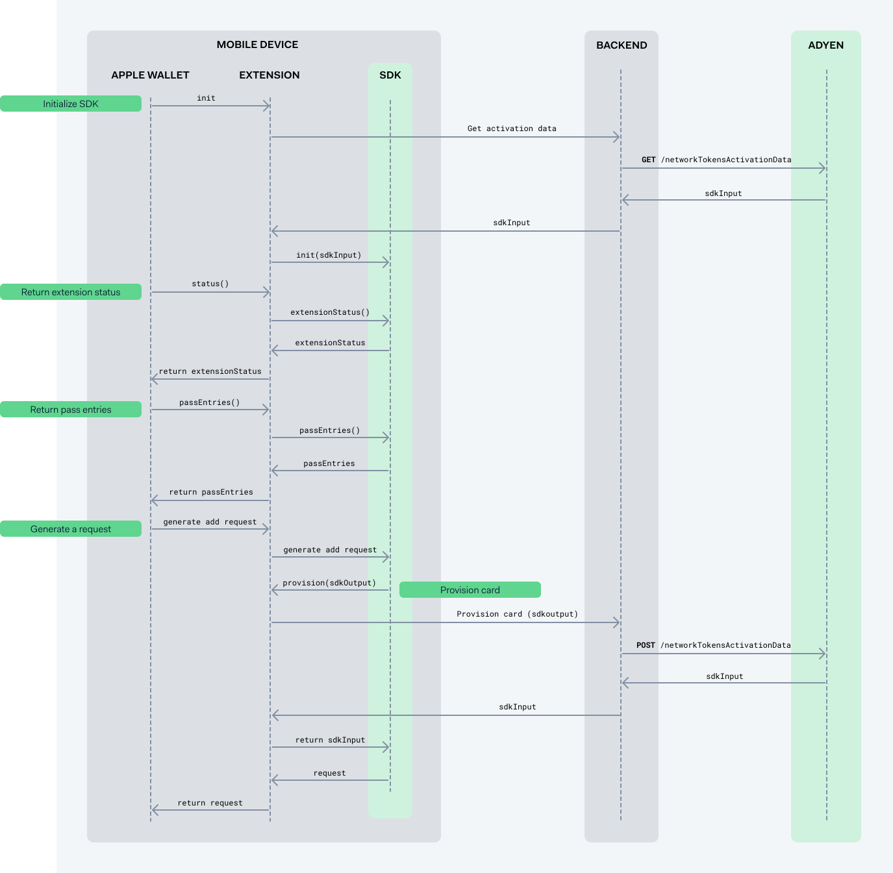

# Adyen Apple Pay Provisioning

Apple Pay In-App Provisioning enables cardholders to add their payment cards to Apple Wallet directly from within your app. With this feature, cardholders can quickly and securely add their payment information to their Apple Wallet, without having to manually enter their card details.

## Get the Adyen SDK

Adyen Apple Pay Provisioning SDK is available on [GitHub](https://github.com/Adyen/adyen-apple-pay-provisioning-ios/). Installation instructions can be found there.

### System requirements

Before you start implementing the Adyen SDK, make sure that your system follows the requirements:

- Your application targets iOS 13.4 or later.
- Your developer environment runs Xcode 14 or later.
- Your developer environment runs Swift 5.7 or later (pre-installed with Xcode 13.2).

## In-app provisioning

With Apple Pay in-app provisioning, your cardholder can start add their card directly from your app. During the in-app flow, the cardholder taps **Add to Apple Wallet** and the provisioning process starts and finishes within your app providing a seamless flow.

The following diagram walks you through the in-app provisioning flow. Green labels correspond to the steps described further on the page:

1. [Get activation data](#get-activation-data)
2. [Check for a card to add to Wallet](#check-for-a-card-to-add-to-wallet)
3. [Initiate card provisioning](#initiate-card-provisioning)
4. [Provision the card](#provision-the-card)
5. [Finalize card provisioning](#finalize-card-provisioning)



### Get activation data

Before you start card provisioning, you must get activation data for the specified payment instrument.

1. From your server, make a GET `/paymentInstruments/{id}/networkTokenActivationData` request and specify the `id` of the payment instrument in the path. To make this request, your [API credential](/issuing/manage-access/api-credentials-web-service) needs the following role:

    - **Bank Issuing PaymentInstrument Network Token Activation Data role**

    ```bash
    curl https://balanceplatform-api-test.adyen.com/bcl/v2/paymentInstruments/{id}/networkTokenActivationData \
    -H 'x-api-key: YOUR_BALANCE_PLATFORM_API_KEY' \
    -H 'content-type: application/json' \
    ```

    The response contains the `sdkInput` object that you need to initialize the provisioning service in the next step.

2. Pass the `sdkInput` to your app.

### Check for a card to add to Wallet

Initialize the `ProvisioningService` class that is used to check if the cardholder can add a payment card to their Apple Wallet.

```swift
import AdyenApplePayProvisioning

let provisioningService = ProvisioningService(sdkInput: sdkInput)
let canAddCard = await provisioningService.canAddCard()
// Show or hide the Add card to Apple Wallet button
```

Use the value returned by the `canAddCard` method to show or hide the **Add card to Apple Wallet** button.

[!NOTE]
If available, you can add a payment card to both iPhone and Apple Watch. To determine the compatibility of the card with a particular device, use the `canAddCardDetails()` function.

### Initiate card provisioning

When the cardholder selects **Add card to Apple Wallet**, use the Adyen SDK to initiate provisioning by calling the `start()` function with two parameters: `delegate` and `presentingViewController`.

```swift
try provisioningService.start(
    delegate: self,
    presentingViewController: viewController
)

```

### Provision the card

Implement `ProvisioningServiceDelegate` to receive the `provision(sdkOutput)` callback from the Adyen SDK. In the callback:

1. From your back end, make a POST `paymentInstruments/{id}/networkTokenActivationData` request and pass `sdkOutput` to provision the payment instrument. The response contains the `sdkInput` object.
2. Return `sdkInput` from the `provision` method.

   ```swift
   func provision(sdkOutput: Data) async -> Data? {
       let sdkInput = // POST `sdkOutput` to server
       return sdkInput
   }
   ```

### Finalize card provisioning

After the provisioning is complete, the Adyen SDK calls the delegate method `didFinishProvisioning`. This callback can be used to update your UI and show **Added to Apple Wallet** or **Available in Apple Wallet**.

```swift
func didFinishProvisioning(with pass: PKPaymentPass?, error: Error?) {
    // Update your UI
}
```

## Wallet provisioning

You can also start card provisioning directly from Apple Wallet. For this to work, you must implement the Apple Wallet extension. After this, your app name and icon will appear in the **From Apps on Your iPhone** list of cards available to be added to the Wallet.

The following diagram walks you through the wallet extension provisioning flow. Green labels correspond to the steps described further on the page:

1. [Return extension status](#return-extension-status)
2. [Return pass entries](#return-pass-entries)
3. [Provision the card](#provision-the-card-from-the-extension)
4. [Generate a request to add a payment pass](#generate-a-request-to-add-a-payment-pass)



### Before you begin

Before you start implementing the Wallet provisioning flow:

1. [Add the Apple Wallet extension](#add-the-apple-wallet-extension).
2. [Add Authentication UI extension](#add-authentication-extension).

#### Add the Apple Wallet extension

To add the Apple Wallet extension:

1. Add a new target to your Xcode project with any Extension template. Then, change the values under the `NSExtension` dictionary in the `Info.plist` as follows:

    |Key|Type|Value|
    |---|---|---|
    | `NSExtension` | String | **com.apple.PassKit.issuer-provisioning** |
    | `NSExtensionPrincipalClass` | String | **$(PRODUCT_MODULE_NAME).ExtensionHandler** |

2. Create an `ExtensionHandler` class that implements the `PKIssuerProvisioningExtensionHandler` protocol. This class manages the issuer-provided extension that is used during the card provisioning process.

    ```swift
    import PassKit

    class ExtensionHandler: PKIssuerProvisioningExtensionHandler {

    }
    ```

#### Add authentication extension

The Apple Wallet authenticates cardholders before allowing them to provision cards. The user interface for this authentication can be implemented by your app, by adding an additional extension. In this extension, you can implement UI to authenticate your user.

1. Add another target to your Xcode project with any Extension template. Change the values under the `NSExtension` dictionary in the `Info.plist` as follows:

    |Key|Type|Value|
    |---|---|---|
    | `NSExtension` | String | **com.apple.PassKit.issuer-provisioning.authorization** |
    | `NSExtensionPrincipalClass` | String | **$(PRODUCT_MODULE_NAME).AuthorizationProvider** |

2. Create an `AuthorizationProvider` class that is a subclass of `UIViewController` and implements the `PKIssuerProvisioningExtensionAuthorizationProviding` protocol. Use the `completionHandler` to communicate if the authentication was successful.

### Return extension status

The Apple Wallet will call the extension while the user is interacting with the Wallet app. Because of this, the extension has strict limits on how much time certain steps can take to execute. The first method that is called on your extension, `status()`, needs to complete within 100 ms. Therefore, it is not possible to reliably to a network call to initialize the Adyen SDK.

1. In your main app, save the `sdkInput` after doing the network call. Retrieve this stored value in your extension. 

2. Initialize the `ExtensionProvisioningService` class. This class manages the custom extension used during the provisioning process for adding new payment cards to the Apple Wallet.

   ```swift
   import AdyenApplePayExtensionProvisioning

   // For one payment instrument:
   let provisioningService = ExtensionProvisioningService(sdkInput: sdkInput) 

   // For multiple payment instruments:
   let provisioningService = ExtensionProvisioningService(sdkInputs: [sdkInput1, sdkInput2, ..])
   ```

3. To implement the `status()` method of the `PKIssuerProvisioningExtensionHandler` protocol, call `extensionStatus()` on the Adyen SDK. Use the `requiresAuthentication` parameter to indicate that you will provide [authentication through the UI extension](#add-authentication-extension). If the `ExtensionProvisioningService` could not be initialized, use `entriesUnavailableExtensionStatus` to indicate that no pass entries are available.

   ```swift
   func status() async -> PKIssuerProvisioningExtensionStatus {
   // Initialize the service
   return provisioningService.extensionStatus(requiresAuthentication: true)

   // If service could not be initialized
   return ExtensionProvisioningService.entriesUnavailableExtensionStatus
   }
   ```

### Return pass entries

To return available passes, implement two methods: `passEntries()` and `remotePassEntries()`. The first method will be called from the Wallet app, the second from the Watch app on iPhone or the Wallet app on Apple Watch. For this step, the time limit is 20 seconds. Because of this, a network call can be performed to refresh the `sdkInput`.

1. From your server, make a GET `/paymentInstruments/{id}/networkTokenActivationData` request and specify the `id` of the payment instrument in the path.

    ```bash
    curl https://balanceplatform-api-test.adyen.com/bcl/v2/paymentInstruments/{id}/networkTokenActivationData \
    -H 'x-api-key: YOUR_BALANCE_PLATFORM_API_KEY' \
    -H 'content-type: application/json' \
    ```

    The response contains the `sdkInput` that you need to initialize the provisioning service in the next step.  If the extension needs to show multiple payment instruments, request `sdkInput` for each one.

2. Initialize the `ExtensionProvisioningService` class.

    ```swift
    import AdyenApplePayExtensionProvisioning

    // For one payment instrument:
    let provisioningService = ExtensionProvisioningService(sdkInput: sdkInput) 

    // For multiple payment instruments:
    let provisioningService = ExtensionProvisioningService(sdkInputs: [sdkInput1, sdkInput2, ..])
    ```

3. The Wallet app will show a preview of the card(s) to the user. To supply the SDK with the correct image of the card, implement `ExtensionProvisioningServiceDelegate` to receive the `cardArt(forBrand: String)` callback from the Adyen SDK. In this method, return the card art for the specified brand. Make sure the card art accurately represents the card that will be added to Apple Wallet.

   ```swift
   func cardArt(forBrand brand: String) -> CGImage {
       // Return card art
   }
   ```

4. Implement the methods `passEntries()` and `remotePassEntries()` by calling the corresponding methods of the SDK. Supply the delegate created in the previous step.

   ```swift
   func passEntries() async -> [PKIssuerProvisioningExtensionPassEntry] {
     return provisioningService.passEntries(withDelegate: delegate)
   }

   func remotePassEntries() async -> [PKIssuerProvisioningExtensionPassEntry] {
     return provisioningService.remotePassEntries(withDelegate: delegate)
   }
   ```

### Provision the card from the extension

To provision the card when the extension requests it:

1. Implement `ExtensionProvisioningServiceDelegate` to receive the `provision(paymentInstrumentId, sdkOutput)` callback from the Adyen SDK.
2. In the callback, make a POST `paymentInstruments/{id}/networkTokenActivationData` request and pass `sdkOutput` to provision the payment instrument.
3. Return the `sdkInput` from the response back to Adyen SDK.

   ```swift
   func provision(paymentInstrumentId: String, sdkOutput: Data) async -> Data? {
       let sdkInput = // POST `sdkOutput` to server
       return sdkInput
   }
   ```

### Generate a request to add a payment pass

To generate a request for adding a card:

1. The `ExtensionHandler` class will be re-instantiated for each `PKIssuerProvisioningExtensionHandler` method call. This means that you will need to re-initialize the Adyen SDK. Follow steps 1 and 2 from [the previous chapter]{#return-pass-entries}.

2. To implement the `generateAddPaymentPassRequestForPassEntryWithIdentifier()` method of the `PKIssuerProvisioningExtensionHandler` class, call the method with the same name from the Adyen SDK to obtain a pass request. This call has an additional parameter `delegate` that will be called to handle [card provisioning](#provision-the-card-from-the-extension). The method returns the pass request, that can then be passed to the extension.

   ```swift
   func generateAddPaymentPassRequestForPassEntryWithIdentifier(
       _ identifier: String,
       configuration: PKAddPaymentPassRequestConfiguration,
       certificateChain certificates: [Data],
       nonce: Data,
       nonceSignature: Data
   ) async -> PKAddPaymentPassRequest? {
       try? await provisioningService.generateAddPaymentPassRequestForPassEntryWithIdentifier(
           identifier,
           configuration: configuration,
           certificateChain: certificates,
           nonce: nonce,
           nonceSignature: nonceSignature,
           delegate: self
       )
   }
   ```